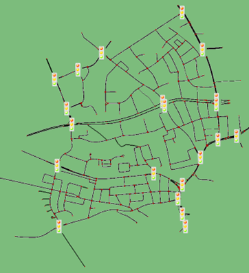

# Traffic-light-optimization: A decentralized Multi-agent reinforcement learning approach
## Intro
This investigation project aims to address traffic congestion in urban areas by leveraging reinforced learning techniques to optimize
traffic light timings. Traditional methods are either inefficient, static, expensive, unreliable or a combination of the aforementioned points. This
paper formulates an optimization problem with the objective of minimizing the average vehicle wait time under a cost constraint, and proposes
using a traffic simulator to train a model that acquires real-time data from GPS-based applications like Waze or Google Maps, enabling it to learn
and optimize traffic light timings. The project was implemented in six stages: research, design of single and multi-agent system models, data
collection and map integration, creation of a camera, GPS, and advanced observation environment, optimization and hyper-parameter tuning, and
concluding with result generation and documentation. The optimal solution was solved using a PPO algorithm where the environment was
simulated using SUMO and the agent trained in a PettingZoo gym with Sumo-rl. Training was both improved and made faster using Optuna and
SuperSuit in tandem with a custom observation and reward class. The simulation results demonstrate that the proposed GPS model surpasses
existing implementations in 72% of cases, with a potential for a 25.7% performance boost to 97.6% in an idealistic environment. In addition the
proposed engineering solution is a fraction of the cost and exhibits great flexibility and scalability in both the type and number of intersections.

