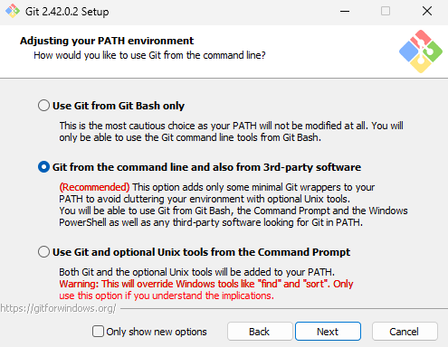
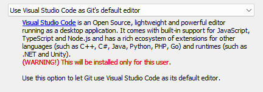
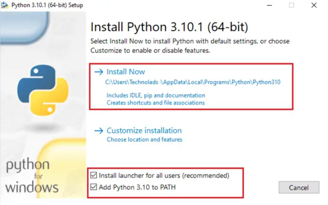

# Traffic Light Optimization
==================================

## 1. Code Setup
### 1.1 Install SUMO
- You can download SUMO from: https://sumo.dlr.de/docs/Downloads.php

### 1.2 Install git
- https://git-scm.com/downloads
- Tick the option tha enables git to be added to the path
- Select vscode as the default editor for git
  

### 1.3 Install python 3
- https://www.python.org/downloads/
- Install python 3.11.5 and not python 3.12.0!!!
  

### 1.4 Install VS c++
- https://aka.ms/vs/16/release/vc_redist.x64.exe

### 1.5 Install dependencies
- pip install sumo-rl
- pip install optuna
- pip install optuna-dashboard
- pip install supersuit
- pip install stable-baselines3[extra]
- pip install seaborn

### 1.6 [Optional] Create a network file using the netedit application that comes with SUMO
- Define nodes, edges, traffic lights, etc. 
- Checkout the SUMO tutorials for more information: https://sumo.dlr.de/docs/Tutorials/ 
- Save the network file (.net.xml) 

### 1.7 [Optional] Create a route file within the network using netedit
- This is done by defining traffic flows and routes within the demand section of netedit.
- Save the route file (.rou.xml)

### 1.8 Replace the files that need to be replaced in your python sumo-rl pip package
- Type pip show sumo-rl in the terminal 
- Navigate to the sumo-rl folder
- Replace the files that need to be replaced (from the files to be replaced folder) in your python sumo-rl pip package
  
## 2. Train instructions
- Navigate to the Investigation-Project folder
- Define parameters, model, type, and reward at the top of Multi-Agent-Train.py
- Type python Multi-Agent-Train.py in the terminal
- Note: ensure that your computer has the number of cpu's that you specify in the Multi-Agent-Train.py file

## 3. Simulation instructions
- Define parameters, model, type, and reward at the top of Multi-Agent-Simulation.py that correspond to your trained model
- Type multi-agent-simulation.py in the terminal

## 4. Plot graphs
Plots are saved as pdfs in the plots folder

### 4.1 Repair your result files
- python repair.py -f ./{path to folder}

### 4.2 Plot one or multiple simulations on the same graph
- python plot.py -f ./results/train/cologne8-PPO-ob11-default_conn1 ./results/greedy/cologne8-camera_conn1 ./etc

### 4.3 Rank multiple models
- python rank.py -f ./plots/{rank_csv_name}.csv

### 4.4 Plot training progress
- python plot_training_progress.py -f ./results/{path with name without conn}_conn -conn {num conns}
- python plot_training_progress.py -f ./results/marl_train/marl_train-cologne8-PPO-ideal-defandspeed_conn ./results/greedy/cologne8-greedy-ideal_conn ./results/marl_sim/marl_sim-cologne8-PPO-ideal-defandspeed_conn ./results/max_pressure/cologne8-max_pressure-ideal_conn ./results/marl_train/marl_train-cologne8-PPO-camera-defandspeed_conn ./results/fixed/cologne8-fixed-none_conn -conn 3 -start 2 -stop 30 -t cologne8

## 5. Hyper parameter tuning
### 5.1 Train instructions
- Navigate to the Investigation-Project folder
- Define parameters, model, type, and reward at the top of Multi-Agent-Tuned-Train.py
- Type python Multi-Agent-Tuned-Train.py in the terminal
- Note: ensure that your computer has the number of cpu's that you specify in the Multi-Agent-Tuned-Train.py file

### 5.2 View results
- CD into the optuna folder
- Type optuna-dashboard sqlite:///{name}.sqlite3 in the terminal
- Remember to replace name with the name of the database you generated in the optuna folder

#### For a better explanation of the code, checkout the sumo-rl documentation
- https://lucasalegre.github.io/sumo-rl/documentation/sumo_env/
