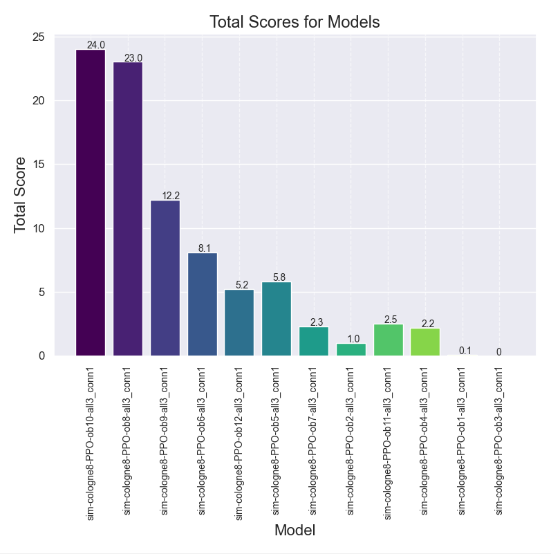
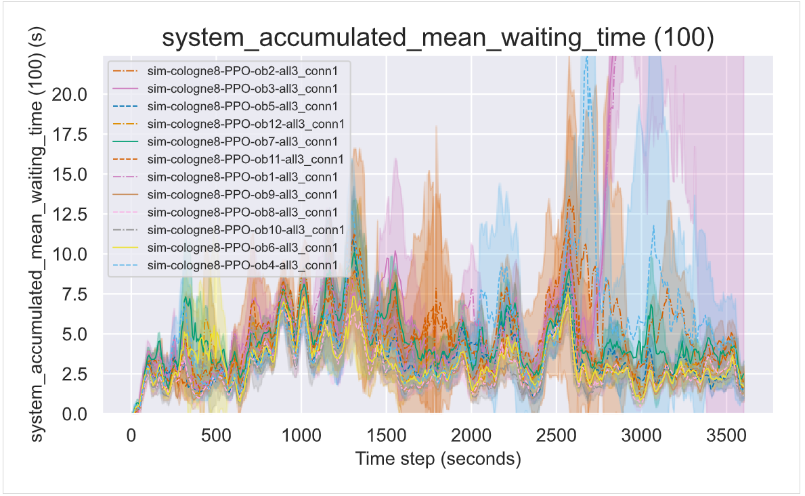
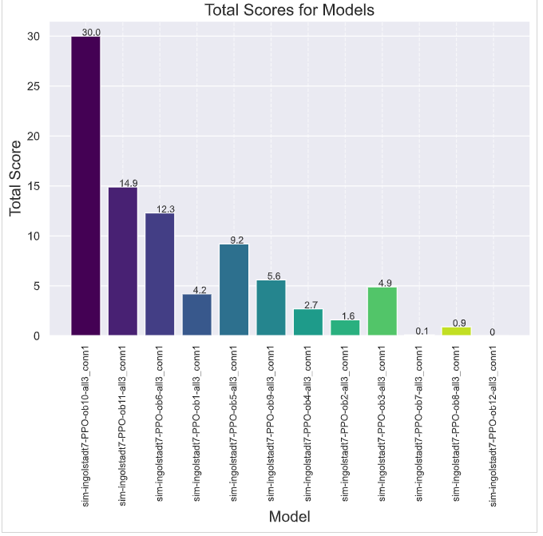
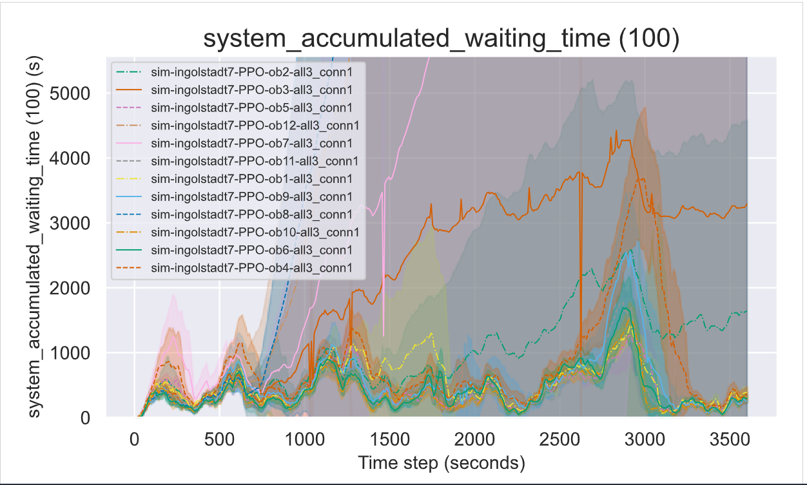

# Ranking the different observations for cologne
['ob1', 'ob2', 'ob3', 'ob4', 'ob5', 'ob6', 'ob7', 'ob8', 'ob9', 'ob10', 'ob11', 'ob12']

## Plot commands
#### Train: 
python plot.py -f ./results/observations/cologne8-PPO-ob2-all3_conn1 ./results/observations/cologne8-PPO-ob3-all3_conn1 ./results/observations/cologne8-PPO-ob5-all3_conn1 ./results/observations/cologne8-PPO-ob12-all3_conn1 ./results/observations/cologne8-PPO-ob7-all3_conn3 ./results/observations/cologne8-PPO-ob11-all3_conn1 ./results/observations/cologne8-PPO-ob1-all3_conn1 ./results/observations/cologne8-PPO-ob9-all3_conn1 ./results/observations/cologne8-PPO-ob8-all3_conn1 ./results/observations/cologne8-PPO-ob10-all3_conn1 ./results/observations/cologne8-PPO-ob6-all3_conn1 ./results/observations/cologne8-PPO-ob4-all3_conn1

#### Last:
python plot.py -f ./results/observations/cologne8-PPO-ob2-all3_conn1_ep40 ./results/observations/cologne8-PPO-ob3-all3_conn1_ep40 ./results/observations/cologne8-PPO-ob5-all3_conn1_ep40 ./results/observations/cologne8-PPO-ob12-all3_conn1_ep40 ./results/observations/cologne8-PPO-ob7-all3_conn3_ep40 ./results/observations/cologne8-PPO-ob11-all3_conn1_ep40 ./results/observations/cologne8-PPO-ob1-all3_conn1_ep40 ./results/observations/cologne8-PPO-ob9-all3_conn1_ep40 ./results/observations/cologne8-PPO-ob8-all3_conn1_ep40 ./results/observations/cologne8-PPO-ob10-all3_conn1_ep40 ./results/observations/cologne8-PPO-ob6-all3_conn3_ep40 ./results/observations/cologne8-PPO-ob4-all3_conn1_ep40

#### Sim:
python plot.py -f ./results/observations/sim-cologne8-PPO-ob2-all3_conn1 ./results/observations/sim-cologne8-PPO-ob3-all3_conn1 ./results/observations/sim-cologne8-PPO-ob5-all3_conn1 ./results/observations/sim-cologne8-PPO-ob12-all3_conn1 ./results/observations/sim-cologne8-PPO-ob7-all3_conn1 ./results/observations/sim-cologne8-PPO-ob11-all3_conn1 ./results/observations/sim-cologne8-PPO-ob1-all3_conn1 ./results/observations/sim-cologne8-PPO-ob9-all3_conn1 ./results/observations/sim-cologne8-PPO-ob8-all3_conn1 ./results/observations/sim-cologne8-PPO-ob10-all3_conn1 ./results/observations/sim-cologne8-PPO-ob6-all3_conn1 ./results/observations/sim-cologne8-PPO-ob4-all3_conn1

## Rank commands
#### Train: 
python rank.py -f ./plots/cologne8-[PPO-ob2-all3]-[PPO-ob3-all3]-[PPO-ob5-all3]-[PPO-ob12-all3]-[PPO-ob7-all3]-[PPO-ob11-all3]-[PPO-ob1-all3]-[PPO-ob9-all3]-[PPO-ob8-all3]-[PPO-ob10-all3]-[PPO-ob6-all3]-[PPO-ob4-all3]_conn1.csv

#### Last:
python rank.py -f ./plots/cologne8-last-ep-[PPO-ob2-all3]-[PPO-ob3-all3]-[PPO-ob5-all3]-[PPO-ob12-all3]-[PPO-ob7-all3]-[PPO-ob11-all3]-[PPO-ob1-all3]-[PPO-ob9-all3]-[PPO-ob8-all3]-[PPO-ob10-all3]-[PPO-ob6-all3]-[PPO-ob4-all3]_conn1.csv 

#### Sim:
python rank.py -f ./plots/cologne8-sim-[PPO-ob2-all3]-[PPO-ob3-all3]-[PPO-ob5-all3]-[PPO-ob12-all3]-[PPO-ob7-all3]-[PPO-ob11-all3]-[PPO-ob1-all3]-[PPO-ob9-all3]-[PPO-ob8-all3]-[PPO-ob10-all3]-[PPO-ob6-all3]-[PPO-ob4-all3]_conn1.csv

# Ranking the different observations for Ingolstadt

## Plot commands
#### Sim:
python plot.py -f ./results/observations/sim-ingolstadt7-PPO-ob2-all3_conn1 ./results/observations/sim-ingolstadt7-PPO-ob3-all3_conn1 ./results/observations/sim-ingolstadt7-PPO-ob5-all3_conn1 ./results/observations/sim-ingolstadt7-PPO-ob12-all3_conn1 ./results/observations/sim-ingolstadt7-PPO-ob7-all3_conn1 ./results/observations/sim-ingolstadt7-PPO-ob11-all3_conn1 ./results/observations/sim-ingolstadt7-PPO-ob1-all3_conn1 ./results/observations/sim-ingolstadt7-PPO-ob9-all3_conn1 ./results/observations/sim-ingolstadt7-PPO-ob8-all3_conn1 ./results/observations/sim-ingolstadt7-PPO-ob10-all3_conn1 ./results/observations/sim-ingolstadt7-PPO-ob6-all3_conn1 ./results/observations/sim-ingolstadt7-PPO-ob4-all3_conn1

## Rank commands
#### Sim:
python rank.py -f ./plots/ingolstadt7-sim-[PPO-ob2-all3]-[PPO-ob3-all3]-[PPO-ob5-all3]-[PPO-ob12-all3]-[PPO-ob7-all3]-[PPO-ob11-all3]-[PPO-ob1-all3]-[PPO-ob9-all3]-[PPO-ob8-all3]-[PPO-ob10-all3]-[PPO-ob6-all3]-[PPO-ob4-all3]_conn1.csv

