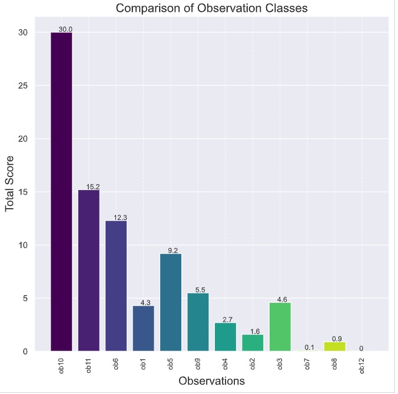
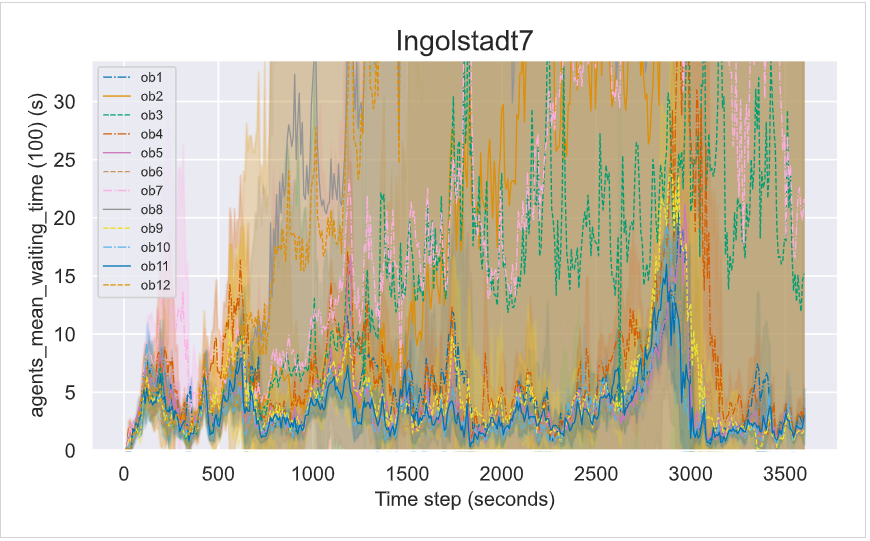

# Ranking the different observations for Ingolstadt

## Plot commands
#### Sim:
python plot.py -f ./results/observations/ingolstadt7/sim-ingolstadt7-PPO-ob1-all3_conn1 ./results/observations/ingolstadt7/sim-ingolstadt7-PPO-ob2-all3_conn1 ./results/observations/ingolstadt7/sim-ingolstadt7-PPO-ob3-all3_conn1 ./results/observations/ingolstadt7/sim-ingolstadt7-PPO-ob4-all3_conn1 ./results/observations/ingolstadt7/sim-ingolstadt7-PPO-ob5-all3_conn1 ./results/observations/ingolstadt7/sim-ingolstadt7-PPO-ob6-all3_conn1 ./results/observations/ingolstadt7/sim-ingolstadt7-PPO-ob7-all3_conn1 ./results/observations/ingolstadt7/sim-ingolstadt7-PPO-ob8-all3_conn1 ./results/observations/ingolstadt7/sim-ingolstadt7-PPO-ob9-all3_conn1 ./results/observations/ingolstadt7/sim-ingolstadt7-PPO-ob10-all3_conn1 ./results/observations/ingolstadt7/sim-ingolstadt7-PPO-ob11-all3_conn1 ./results/observations/ingolstadt7/sim-ingolstadt7-PPO-ob12-all3_conn1 -t Ingolstadt7 -l ob1 ob2 ob3 ob4 ob5 ob6 ob7 ob8 ob9 ob10 ob11 ob12

## Rank commands
#### Sim:
python rank.py -f ./plots/ingolstadt7/ingolstadt7-sim-observations.csv -xh Observations -t "Comparison of Observation Classes"

