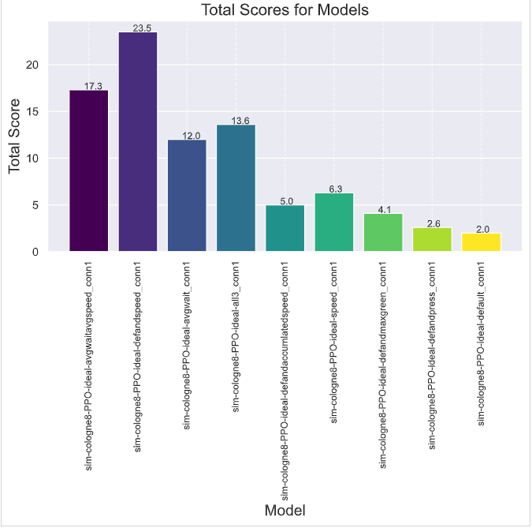
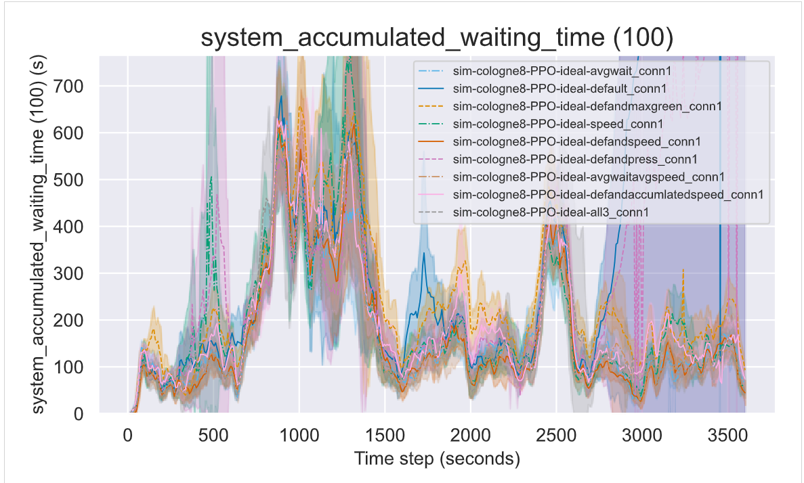

# Ranking the different rewards
['all3', 'default', 'defandmaxgreen','speed','defandspeed','defandpress','all3','avgwait','avgwaitavgspeed','defandaccumlatedspeed']

## Plot commands
#### Train: 
python plot.py -f ./results/rewards/cologne8-PPO-ideal-avgwait_conn2 ./results/rewards/cologne8-PPO-ideal-default_conn1 ./results/rewards/cologne8-PPO-ideal-defandmaxgreen_conn1 ./results/rewards/cologne8-PPO-ideal-speed_conn1 ./results/rewards/cologne8-PPO-ideal-defandspeed_conn1 ./results/rewards/cologne8-PPO-ideal-defandpress_conn1 ./results/rewards/cologne8-PPO-ideal-avgwaitavgspeed_conn1 ./results/rewards/cologne8-PPO-ideal-defandaccumlatedspeed_conn1 ./results/rewards/cologne8-PPO-ideal-all3_conn2

#### Last:
python plot.py -f ./results/rewards/cologne8-PPO-ideal-avgwait_conn2_ep40 ./results/rewards/cologne8-PPO-ideal-default_conn1_ep40 ./results/rewards/cologne8-PPO-ideal-defandmaxgreen_conn1_ep40 ./results/rewards/cologne8-PPO-ideal-speed_conn1_ep40 ./results/rewards/cologne8-PPO-ideal-defandspeed_conn1_ep40 ./results/rewards/cologne8-PPO-ideal-defandpress_conn1_ep40 ./results/rewards/cologne8-PPO-ideal-avgwaitavgspeed_conn1_ep40 ./results/rewards/cologne8-PPO-ideal-defandaccumlatedspeed_conn1_ep40 ./results/rewards/cologne8-PPO-ideal-all3_conn2_ep40

#### Sim:
python plot.py -f ./results/rewards/sim-cologne8-PPO-ideal-avgwait_conn1 ./results/rewards/sim-cologne8-PPO-ideal-default_conn1 ./results/rewards/sim-cologne8-PPO-ideal-defandmaxgreen_conn1 ./results/rewards/sim-cologne8-PPO-ideal-speed_conn1 ./results/rewards/sim-cologne8-PPO-ideal-defandspeed_conn1 ./results/rewards/sim-cologne8-PPO-ideal-defandpress_conn1 ./results/rewards/sim-cologne8-PPO-ideal-avgwaitavgspeed_conn1 ./results/rewards/sim-cologne8-PPO-ideal-defandaccumlatedspeed_conn1 ./results/rewards/sim-cologne8-PPO-ideal-all3_conn1

## Rank commands
#### Train: 
python rank.py -f ./plots/cologne8-[PPO-ideal-avgwait]-[PPO-ideal-default]-[PPO-ideal-defandmaxgreen]-[PPO-ideal-speed]-[PPO-ideal-defandspeed]-[PPO-ideal-defandpress]-[PPO-ideal-avgwaitavgspeed]-[PPO-ideal-defandaccumlatedspeed]-[PPO-ideal-all3]_conn2.csv

#### Last:
python rank.py -f ./plots/cologne8-[PPO-ideal-avgwait]-[PPO-ideal-default]-[PPO-ideal-defandmaxgreen]-[PPO-ideal-speed]-[PPO-ideal-defandspeed]-[PPO-ideal-defandpress]-[PPO-ideal-avgwaitavgspeed]-[PPO-ideal-defandaccumlatedspeed]-[PPO-ideal-all3]_conn2_last.csv

#### Sim:
python rank.py -f ./plots/cologne8-sim-[PPO-ideal-avgwait]-[PPO-ideal-default]-[PPO-ideal-defandmaxgreen]-[PPO-ideal-speed]-[PPO-ideal-defandspeed]-[PPO-ideal-defandpress]-[PPO-ideal-avgwaitavgspeed]-[PPO-ideal-defandaccumlatedspeed]-[PPO-ideal-all3]_conn1.csv

