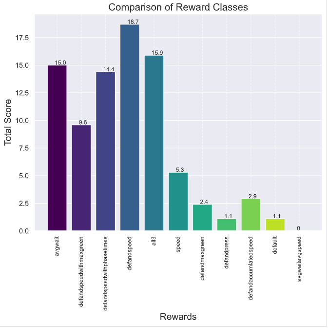
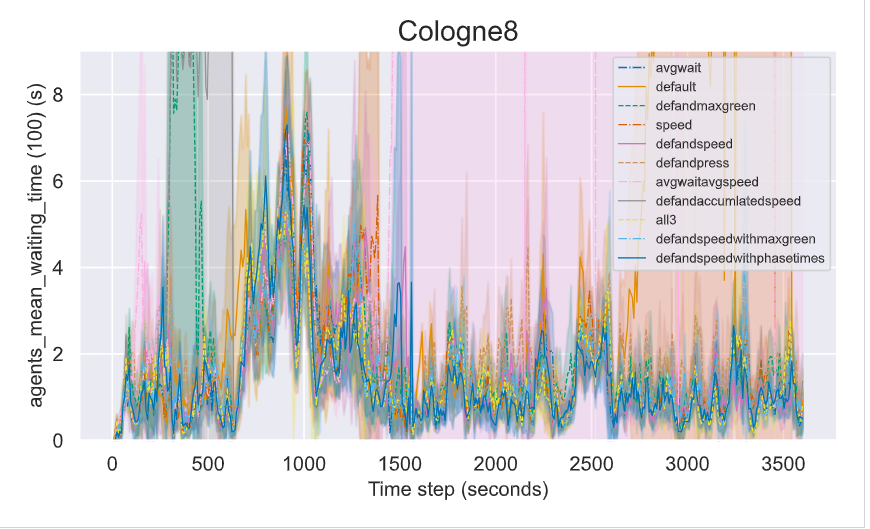

# Ranking the different rewards for Cologne
['all3', 'default', 'defandmaxgreen','speed','defandspeed','defandpress','all3','avgwait','avgwaitavgspeed','defandaccumlatedspeed']

## Plot commands
#### Train: 
python plot.py -f ./results/rewards/cologne8/cologne8-PPO-ob6-avgwait_conn1 ./results/rewards/cologne8/cologne8-PPO-ob6-default_conn1 ./results/rewards/cologne8/cologne8-PPO-ob6-defandmaxgreen_conn1 ./results/rewards/cologne8/cologne8-PPO-ob6-speed_conn1 ./results/rewards/cologne8/cologne8-PPO-ob6-defandspeed_conn1 ./results/rewards/cologne8/cologne8-PPO-ob6-defandpress_conn1 ./results/rewards/cologne8/cologne8-PPO-ob6-avgwaitavgspeed_conn1 ./results/rewards/cologne8/cologne8-PPO-ob6-defandaccumlatedspeed_conn1 ./results/rewards/cologne8/cologne8-PPO-ob6-all3_conn1 ./results/rewards/cologne8/cologne8-PPO-ob6-defandspeedwithmaxgreen_conn1 ./results/rewards/cologne8/cologne8-PPO-ob6-defandspeedwithphasetimes_conn1 -t Cologne8 -l avgwait default defandmaxgreen speed defandspeed defandpress avgwaitavgspeed defandaccumlatedspeed all3 defandspeedwithmaxgreen defandspeedwithphasetimes

#### Sim:
python plot.py -f ./results/rewards/cologne8/sim-cologne8-PPO-ob6-avgwait_conn1 ./results/rewards/cologne8/sim-cologne8-PPO-ob6-default_conn1 ./results/rewards/cologne8/sim-cologne8-PPO-ob6-defandmaxgreen_conn1 ./results/rewards/cologne8/sim-cologne8-PPO-ob6-speed_conn1 ./results/rewards/cologne8/sim-cologne8-PPO-ob6-defandspeed_conn1 ./results/rewards/cologne8/sim-cologne8-PPO-ob6-defandpress_conn1 ./results/rewards/cologne8/sim-cologne8-PPO-ob6-avgwaitavgspeed_conn1 ./results/rewards/cologne8/sim-cologne8-PPO-ob6-defandaccumlatedspeed_conn1 ./results/rewards/cologne8/sim-cologne8-PPO-ob6-all3_conn1 ./results/rewards/cologne8/sim-cologne8-PPO-ob6-defandspeedwithmaxgreen_conn1 ./results/rewards/cologne8/sim-cologne8-PPO-ob6-defandspeedwithphasetimes_conn1 -t Cologne8 -l avgwait default defandmaxgreen speed defandspeed defandpress avgwaitavgspeed defandaccumlatedspeed all3 defandspeedwithmaxgreen defandspeedwithphasetimes 

## Rank commands
#### Train: 
python rank.py -f ./plots/cologne8/cologne8-[PPO-ideal-avgwait]-[PPO-ideal-default]-[PPO-ideal-defandmaxgreen]-[PPO-ideal-speed]-[PPO-ideal-defandspeed]-[PPO-ideal-defandpress]-[PPO-ideal-avgwaitavgspeed]-[PPO-ideal-defandaccumlatedspeed]-[PPO-ideal-all3]_conn1.csv

#### Sim:
python rank.py -f ./plots/cologne8/cologne8-sim-rewards.csv -xh Rewards -t "Comparison of Reward Classes"

