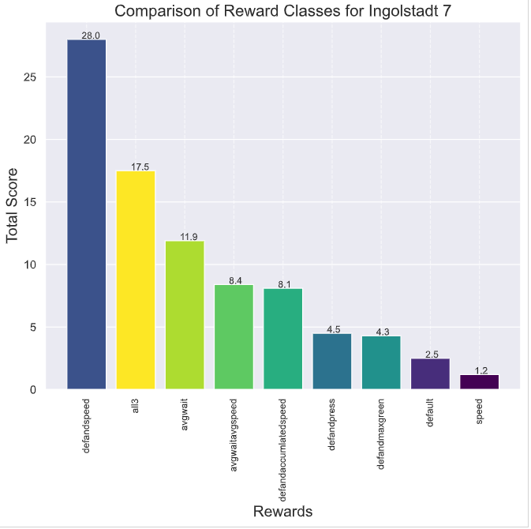
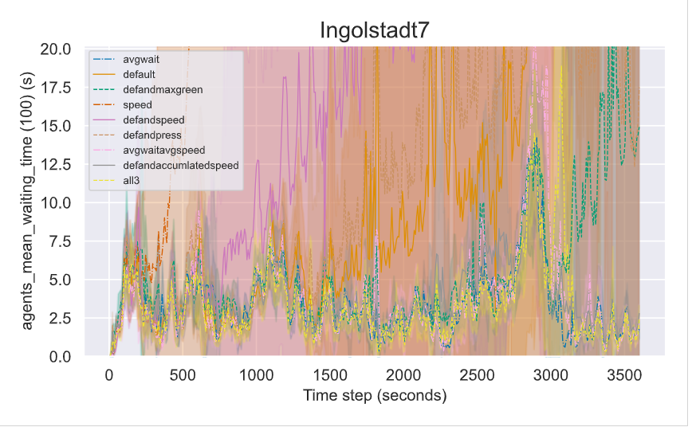

# Ranking the different rewards for Ingolstadt

## Plot commands

#### Sim:
python plot.py -f ./results/rewards/ingolstadt7/sim-ingolstadt7-PPO-ideal-avgwait_conn1 ./results/rewards/ingolstadt7/sim-ingolstadt7-PPO-ideal-default_conn1 ./results/rewards/ingolstadt7/sim-ingolstadt7-PPO-ideal-defandmaxgreen_conn1 ./results/rewards/ingolstadt7/sim-ingolstadt7-PPO-ideal-speed_conn1 ./results/rewards/ingolstadt7/sim-ingolstadt7-PPO-ideal-defandspeed_conn1 ./results/rewards/ingolstadt7/sim-ingolstadt7-PPO-ideal-defandpress_conn1 ./results/rewards/ingolstadt7/sim-ingolstadt7-PPO-ideal-avgwaitavgspeed_conn1 ./results/rewards/ingolstadt7/sim-ingolstadt7-PPO-ideal-defandaccumlatedspeed_conn1 ./results/rewards/ingolstadt7/sim-ingolstadt7-PPO-ideal-all3_conn1 -t Ingolstadt7 -l avgwait default defandmaxgreen speed defandspeed defandpress avgwaitavgspeed defandaccumlatedspeed all3

## Rank commands
#### Sim:
python rank.py -f ./plots/ingolstadt7/ingolstadt7-sim-rewards.csv -xh Rewards -t "Comparison of Reward Classes for ingolstadt 7"

